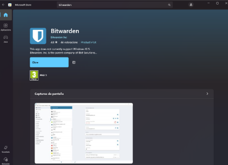
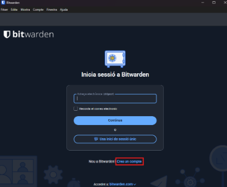
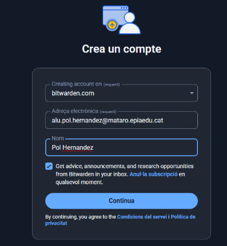
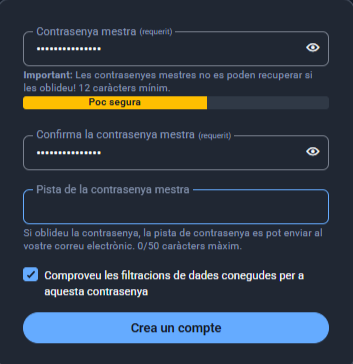
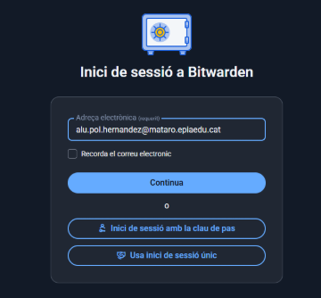
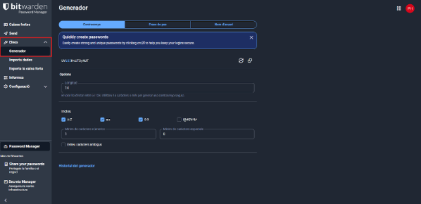
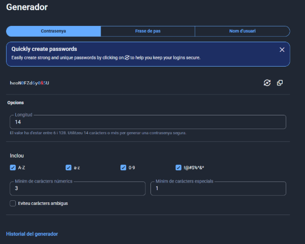
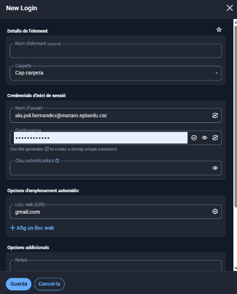
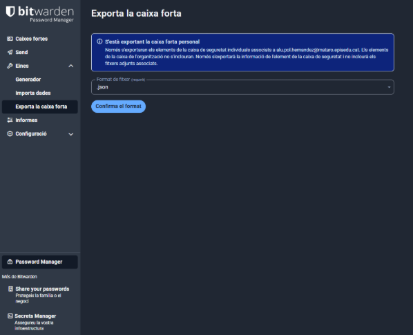
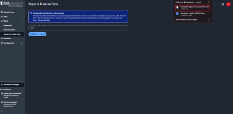

# Fase 2: Guia d'Ús Tècnica (Manual Operatiu)
## 1. Instal·lació i Configuració Inicial: Descàrrega, instal·lació i creació de la BBDD principal o compte mestre.
El primer que haurem de fer és instal·lar el Bitwarden, que per aixó ho farem per la microsoft store o també per la web oficial de Bitwarden.

Un cop  instal·lat, donarem a crear un compte.

En la primera fila ficarem la opció que es veu el la imatge i en la resta de files el nostre correu i nom d’usuari.

Aqui el que haurem de fer és ficar la nostre contrasenya i ens dira si és segura o no.

Quan haguem creat el compte, iniciarem sessió ficant el nostre correu.

## 2. Generació de Contrasenyes Segures: Explicació de com utilitzar el generador de contrasenyes de l'eina (paràmetres, longitud, caràcters especials).
Un cop estem dins de bitwarden farem la generació de contrasenyes. Per això en les pestanyes de la part esquerra donarem a eines i generador i ens sortirà les opcions de dir com volem la nostre contrasenya, per exemple, la
seva longitud, incluir mayúsculas, símbols, etc i donant a generar contrasenyes el que farà és crear contrasenyes.

## 3. Exemples d'Ús i Emplenament Automàtic:
Ara començarem amb la creació de l’empalament automatic. Per fer això el primer és anar a la pestanya principal i apretar a “+Element nou”.

Ens sortirà aquest menú, on aurem de ficar el nostre mail lloc web, per exemple gmail.com i nom d’element, per exemple gmail empresa i donem a guardar.

I ens sortirà aquest altre menú que no haurem de fer res.

El que farem ara és anar a la chrome store per instal·lar l'extensió de Bitwarden, però per això ho haurem de fer per un altre correu perquè amb el de escola ens demana permisos.

Quan s’hagi instal·lat ens surt aquest menú, que haurem d’iniciar sessió.

Un cop fet això, hem d'iniciar sessió en qualsevol pàgina web com per exemple github.

En el moment en que iniciem sessió ens sortirà aquesta alerta que permet guardar la contrasenya a Bitwarden.

Després iniciem sessió en un altre lloc com per exemple el gmail. Quan arribem a l’apartat d’iniciar sessió ens sortirà l'opció de poder vincular el compte de Bitwarden.

Ara tornem a anar al github per iniciar sessió, per en aquest cas haurem de donar a on diu inici de sessió nou.

Ens sortirà aquest menú que haurem de ficar les dades de Bitwarden i donem a guardar.

ara quan tornem al menú d’inici de sessió podrem vincular el nom d’usuari i la contrasenya del Bitwarden.

## 4. Gestió de Còpies de Seguretat (Backup):
Ara faré una explicació de com fer una copia de seguretat de l’arxiu de contrasenyes. Per això, en l’aplicació de bitwarden anirem a la part d’eines i a exporta la caixa forta.
Hi ha diferents tipus d’exportació, el json, que es el més recomanat perquè és fàcil de llegir i el Csv, que és un format que és compatible amb altres gestors de contrasenyes. Un cop donem a confirma el format, fiquem la
contrasenya mestra.

I ho tindrem descarregat.

