T03: Gestió flexible de discos (LVM) 
 
●​ Configuració Inicial: Crear un grup de volums (VG) i un volum lògic (LV) utilitzant inicialment 
un mínim de dos discs durs (simulats) de 10 GB de capacitat. Aquest volum haurà estar 
formatat i muntat automàticament al sistema mitjançant l’edició de l’arxiu /etc/fstab. 
●​ Alta Disponibilitat: Implementar la configuració d’un mirall (lvm_mirror) que protegeixi la 
informació davant la fallada d'un disc. 
●​ Instantànies (snapshots):  Crear i afegir dos discos de 10 GB al grup de volums. Crear un 
volum (lvm_dades) amb el primer disc afegit, formatar-lo i muntar-lo. A continuació afegir 
arxius al volum (poden ser imatges d’Internet). Usar el segon disc afegit per crear un 
snapshot (lv_snapshot) i documentar com es pot restaurar aquest snapshot, si per exemple, 
la informació del volum original es danyés. 
●​ Escalabilitat: Demostrar el procés d'ampliació. Usar l’espai que quedi lliure dins el grup de 
volums per ampliar el volum lv_dades. 
 
1. Configuració inicial 
Primer de tot, es crea una màquina virtual amb Zorin OS.

Abans d’engegar-la, s’hi afegeixen dos discos addicionals de 10 GB cadascun, que 
funcionaran com a nous dispositius físics per al sistema.

Aquí com podem veure s’han creat correctament.

Quan iniciem la màquina, instal·lem l’eina fdisk per verificar que els discos s’han afegit 
correctament: 
sudo apt install fdisk 
Després comprovem la llista de discos disponibles: 
sudo fdisk -l 
A més del disc principal (sda), haurien d’aparèixer els dos nous discos (sdb i sdc).

2. Creació dels volums físics (PV) 
Ara convertirem aquests dos discos nous en volums físics utilitzables per LVM. 
Primer instal·lem LVM: 
sudo apt install lvm2 
I després executem les comandes pvcreate per preparar els discos com a volums físics. 
 
 
 
3. Creació del grup de volums (VG) 
Un cop tenim els PV creats, agrupem aquests discos en un Volume Group (VG). 
Aquest grup és l’espai unificat que utilitzarem per crear posteriorment els volums lògics. 
La comanda per crear el grup és: 
sudo vgcreate volgrup /dev/sdb /dev/sdc 
I podem comprovar-lo amb: 
sudo vgdisplay

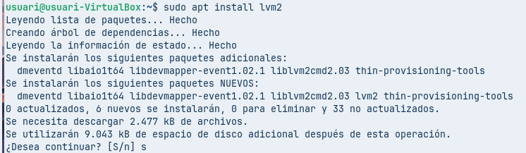

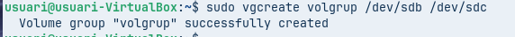

4. Creació del volum lògic (LV) 
Ara ja podem crear volums lògics dins del VG. 
En aquest cas, creem un LV de 200 MiB anomenat lv01 dins del grup volgrup: 
sudo lvcreate -L 200M -n lvCB01 volgrup 
 
Si tornem a mirar la informació del grup, veurem que ja mostra una part de l’espai com a 
utilitzat.

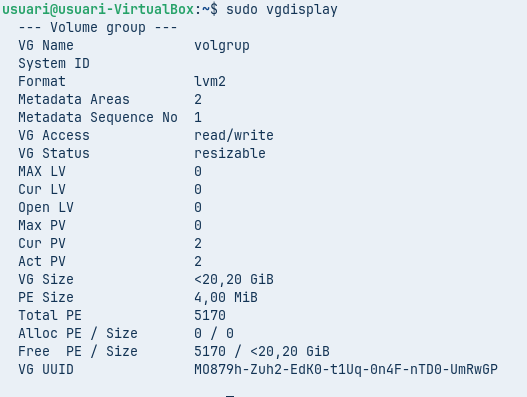

I podem comprovar-lo amb: 
sudo vgdisplay 
 
 
5. Formatació i muntatge del volum lògic 
Igual que una partició normal, un LV necessita un sistema de fitxers per poder ser utilitzat. 
Primer creem una carpeta per muntar-hi el LV: 
sudo mkdir /mnt/lvm_dades

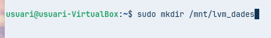

Després el formategem en Ext4: 
sudo mkfs.ext4 /dev/volgrup/lvCB01 
 
I finalment el muntem: 
sudo mount /dev/volgrup/lvCB01 /mnt/lvm_dades 
 
 
Muntatge permanent 
Si volem que el volum es munti automàticament cada vegada que arrenca el sistema, hem 
d’editar /etc/fstab i afegir aquesta línia: 
/dev/volgrup/lvCB01 /mnt/lvm_dades ext4 defaults 0 0 
Després apliquem els canvis.

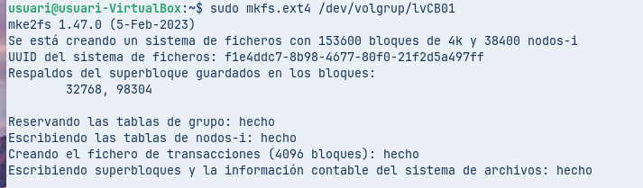

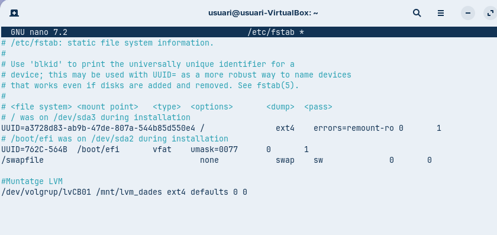

6. Alta disponibilitat (mirror) 
Per aconseguir redundància (semblant a RAID 1), podem crear volums lògics amb mirroring. 
Primer cal eliminar el LV i el VG anterior: 
●​ Desmuntar el LV: 
sudo umount /mnt/lvm_dades​
 
 
 
●​ Eliminar el volum lògic: 
sudo lvremove /dev/volgrup/lvCB01 
 
 
 
Esborrar la línia corresponent de /etc/fstab. 
 
●​ Eliminar el grup de volums: 
sudo vgremove volgrup

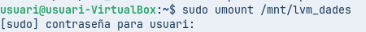

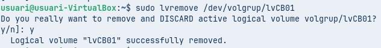

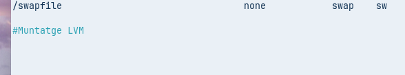

Ara creem un nou VG amb els dos discos: 
sudo vgcreate lvm_mirror /dev/sdb /dev/sdc 
 
 
I creem un volum amb mirroring: 
sudo lvcreate -L 200M -m1 -n mirrorlv lvm_mirror 
 
Podem comprovar la configuració amb: 
sudo lvs -a -o +devices | grep mirror 
 
7. Instantànies (Snapshots) 
Eliminem el volum lògic anterior i creem un de nou de 100 MiB: 
sudo lvcreate -L 100M -n origin volgrup

Després el formategem en Ext4: 
sudo mkfs.ext4 /dev/volgrup/origin 
 
 
 
 
 
 
 
l formategem, el muntem a /mnt/lvm_dades i creem alguns arxius de prova: 
fallocate -l 10M file01 
... 
 
 
Crear la snapshot 
Fem una instantània amb: 
lvcreate -L 100M -s -n lv_snapshot /dev/volgrup/origin

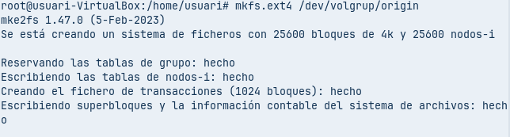

Muntar la snapshot 
Creem una carpeta i la muntem: 
sudo mkdir /mnt/snapshot 
sudo mount /dev/volgrup/lv_snapshot /mnt/snapshot 
 
 
Ara podem comparar continguts: si esborrem un fitxer nou al LV original, no apareixerà a la 
carpeta, però si a la snapshot demostrant que s’ha capturat bé. 
 
 
Recuperació des de la snapshot 
Desmuntem: 
sudo umount /mnt/snapshot 
sudo umount /mnt/lvm_dades 
I restaurem la snapshot, comprovant que desapareixen els fitxers creats posteriorment.

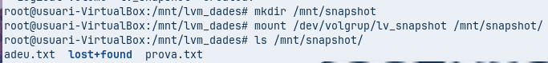

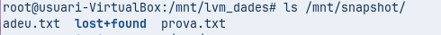

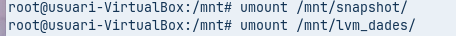

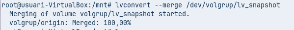

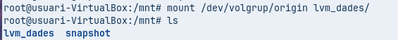

8. Escalabilitat (Ampliar i Reduir Volums Lògics) 
Ampliar o reduir un volum lògic amb lvresize 
L’ordre lvresize permet tant augmentar com disminuir la mida del volum. 
Per exemple, per ampliar 1 GiB: 
sudo lvresize -L 1000M /dev/volgrup/origin 
Després tornem a redimensionar el sistema de fitxers: 
sudo resize2fs /dev/volgrup/origin 
 
 
Ampliar un volum lògic amb lvextend 
Ara ampliarem el volum lògic lv01 afegint-li 500 MiB més: 
sudo lvextend -L 10M /dev/volgrup/origin 
Un cop el volum ha estat ampliat, cal ampliar també el sistema de fitxers: 
sudo resize2fs /dev/volgrup/origin 
 
 
Reduir un volum lògic amb lvreduce 
Comprovem la integritat del sistema de fitxers: 
sudo e2fsck -f /dev/volgrup/origin 
I després reduïm el volum lògic amb: 
sudo lvreduce -L 10M /dev/volgrup/origin

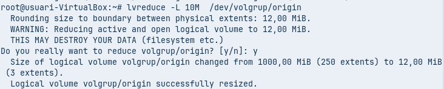

Espais d'Emmagatzematge (Storage 
Spaces) 
 
 
Instal·lació de la màquina virtual Windows: 
 
 
 
Creem tres discs de 10 GB cada per realitzar l’activitat.

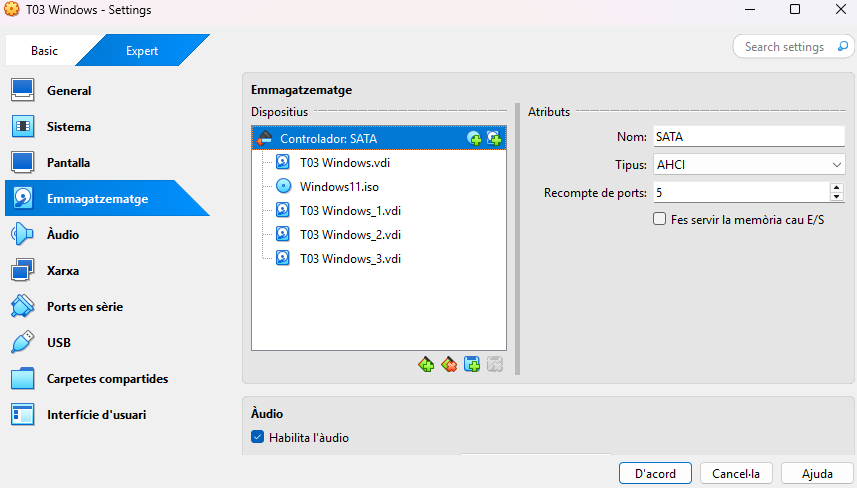

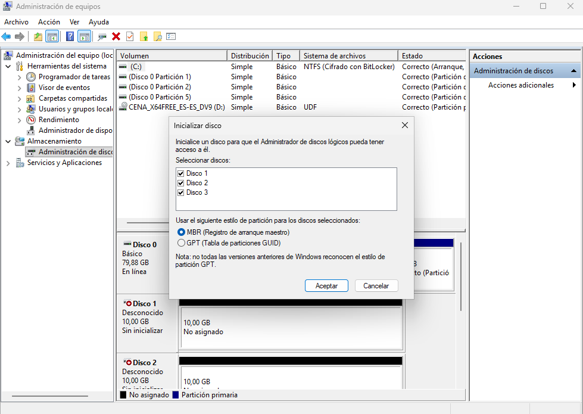

9. Espai d’emmagatzematge (Mirroring) 
 
 
 
Seleccionem tots els discs i creem el grup.

Ja està creat.

Creem un arxiu de prova. 
 
 
 
Eliminem el disc numero 2:​

Per eliminar una resiliència, anem a espais d’emmagatzematge, espais 
d’emmagatzematge i eliminem el que volem. 
 
 
 
Al pressionar “Eliminar”, ens sortirà una advertència per si volem revisar els arxius 
que tenia el disc creat i finalment podrem borrar-lo.

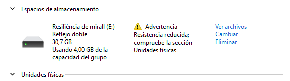

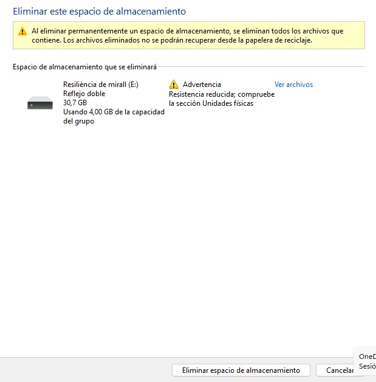

10. Resiliència de Paritat (Parity) 
 
Seleccionem tres discs de 10 GB. Creem el grup. 
 
Posem el nom que volem, elegirem “Paritat” i posem la mida de disc que volguem. 
 
I ja tindrem creada la paritat.

Després l’eliminem igual que s’ha mostrat anteriorment. Aquest procés és el mateix i 
no varia. 
 
 
Per què és millor en eficiència la paritat que el mirall? 
 
La resiliència de paritat és molt més eficient que el mirall perquè té tres discos en 
comptes de dos, per això ofereix un 33% més d’emmagatzematge que si utilitzéssim 
la resiliència de mirall, ja que hi ha dos discos útils en comptes d’un.

11. Resiliència de mirall triple 
 
Per el mirall triple, anyadirem cinc discos de 10 GB. 
 
 
 
 
 
 
 
 
 
Posarem el nom, la resiliència que vulguem i la mida que vulguem el grup.

I ja el tenim creat. 
 
 
 
Podem comprovar a l’explorador d’arxius els espais d’emmagatzematge creats.

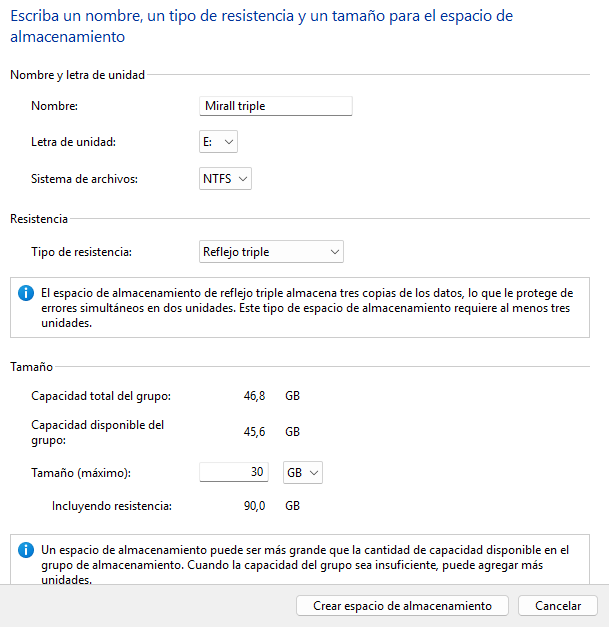

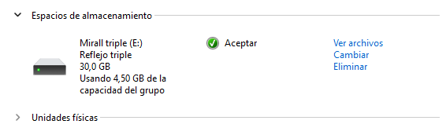

12. Estat dels discos des de la terminal 
 
Per poder veure el pool, executem la terminal i introduïm la seguent comanda: 
​
Get-StoragePool 
 
 
 
I per veure els discos virtuals creats, introduïm la seguent comanda: 
​
Get-VirtualDisk

