# T04: Serveis de directori. LDAP
Primer de tot haurem de canviar el nom del server per *srever.innovatech13.test*.

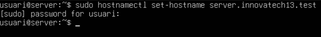

I també el nom de directori.

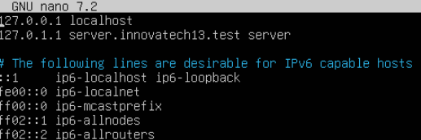

Farem la comanda hostname per verificar que s'ha canviat el nom de la màquina.

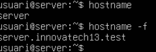

Després configurarem la xarxa de la màquina d’aquesta manera.

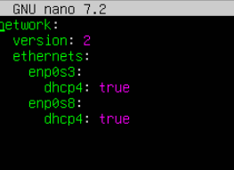

Farem ip a per veure si la ip s’ha configurat correctament.

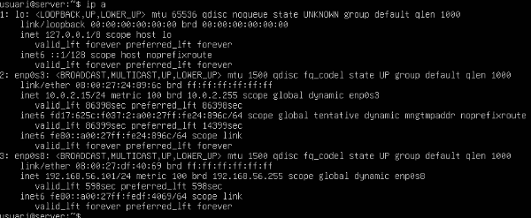

Un cop fet els passos de la configuració inicial, connectarem al interfície de host only.

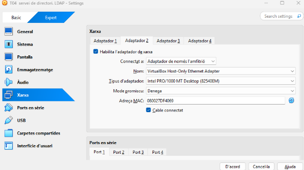

Ara anirem amb l’instal·lació del servei OpenLDAP.

Aquí només hem de ficar la contrasenya que vulguem que tingui el LDAP, per exemple usuari.

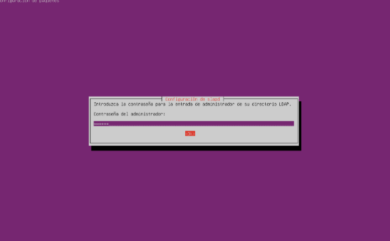

Farem la comanda sudo apt upgrade && update per aplicar els canvis.

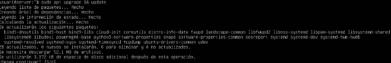

I amb systemctl status slapd i sudo slapcat podem verificar si el servei està activat.

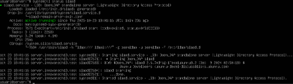

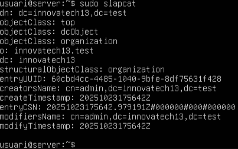

A continuació crearem dues Unitats Organitzatives ( OU ), una d'usuaris i l’altre de users mitjançant un fitxer .ldif.

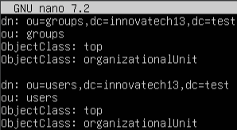

Quan haguem escrit el necessari, implementarem les dos OU per la comanda ldapadd.

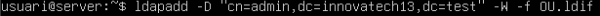

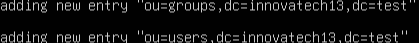

I amb ldapsearch podem veure que estiguin ben implementades.

## 3.2. Gestió i Administració (LAM)
Ara començarem amb la gestió i administració del servei LDAP.
Primer haurem d’instal·lar-lo.

Quan s’hagi instal·lat, haurem de copiar la ip amb ip a

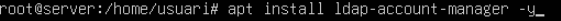

Després hem de anar a un navegador i buscar la ip més /lam/templates/login.php i ens sortirà aquest menú. El que hem de fer aquí és anar a on diu LAM configuration.

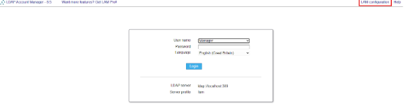

Després a edit server profiles.

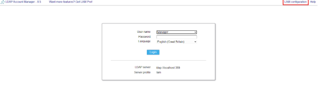

I haurem de ficar la contrasenya, que és lam.

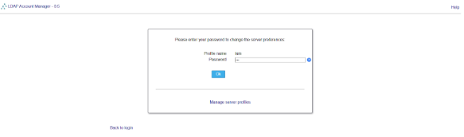

Un cop a dins, en la secció server settings ficarem el que surt en la captura.

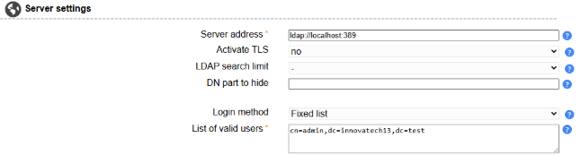

En la secció tool settings ficarem això.

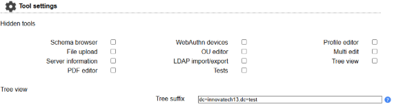

I en la segona pestanya de account types, que esta a la part superior i en la secció active account types fiquem el que surt en la captura.

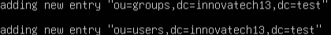

I aplicarem el anvis en save a la part inferior.
Després haurem de anar a la pestanya d’inici i ficar la contrasenya que tinguem del LDAP.

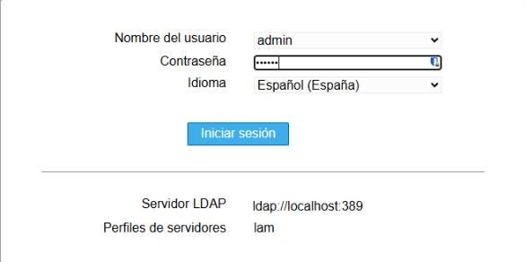

Un cop hem iniciat sessió, anem a la secció de grupos per crear els grups.

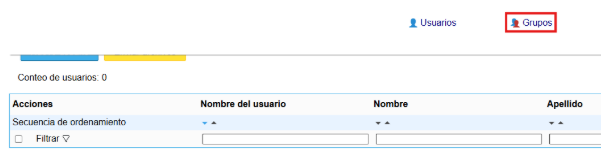

Crearem els dos grups de tech i manager.

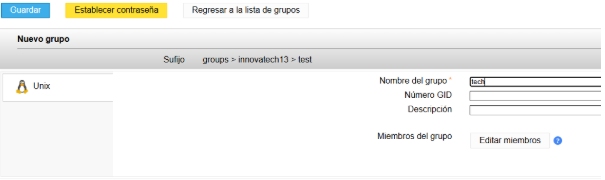

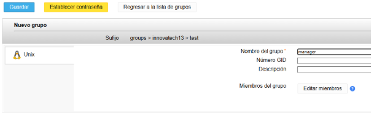

Ara crearem usuaris. Donem a nuevo usuario.

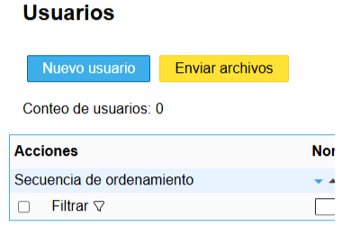

El primer es dirà tech01 i anem a la secció de Unix.

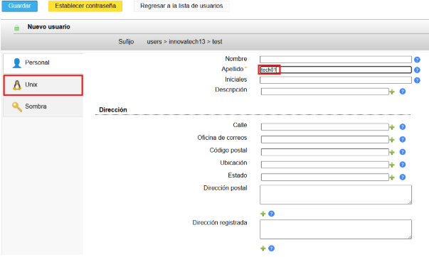

I ficarem el surt en la captura.

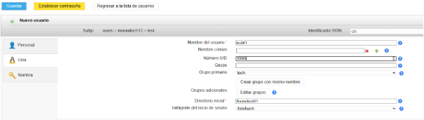

I el mateix però amb manager01.

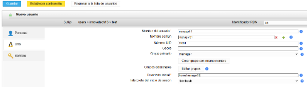

## 4. Integració de Client (Client Ubuntu Desktop)
En la màquina client ficarem la segona interficie en host only.

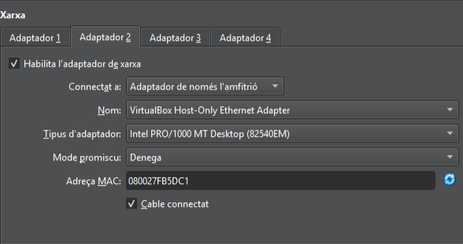

Un cop a dins, anem a la terminal i canviem el nom de domini.

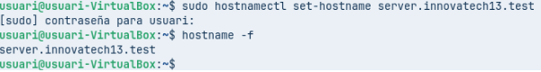

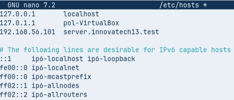

Utilitzem la comanda dig per veure si els noms funcionen bé.

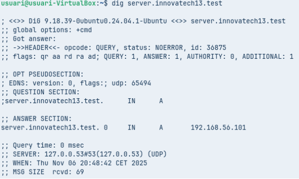

Ara instal·larem el ldap.

I en les configuracions de paquets fiquem el que surt en les captures.

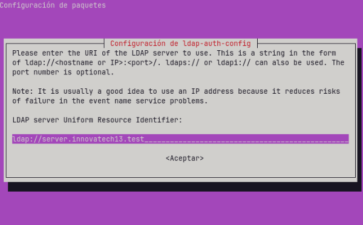

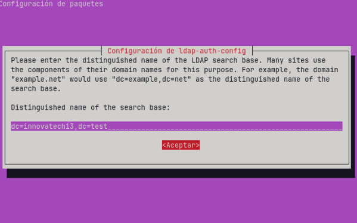

La versió que elegim dona igual.

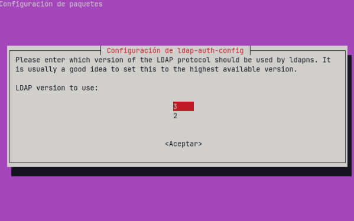

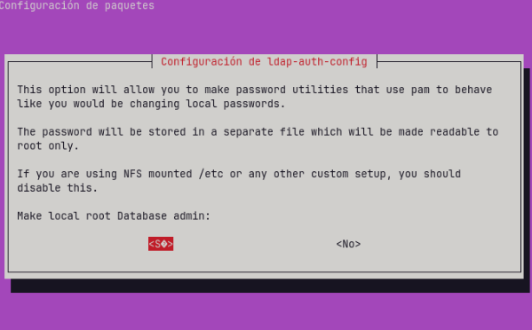

Aqui fiquem la contrasenya del lam.

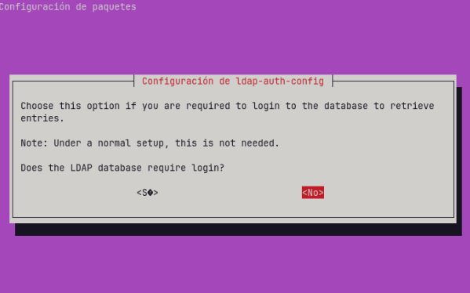

Amb aquesta comanda veurem si el client es connecta amb el servidor.

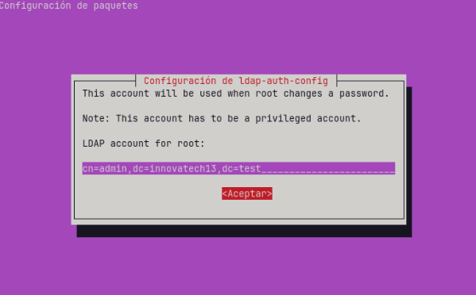

Ara entrarem a l’arxiu següent.

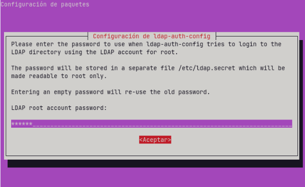

I ho configurarem com en la captura.

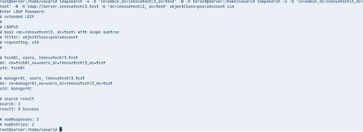

Ara entrem en aquest fitxer per per eliminar la línea marcada.

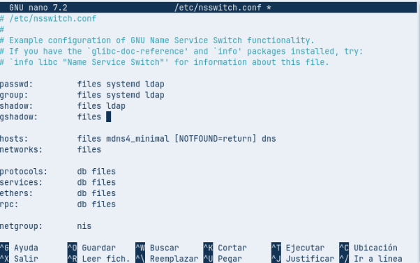

Després entrem en aquest fitxer i afegim la línea marcada.

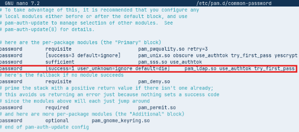

Resetejem el nsdc per guardar bé els canvis.

Ara mirem si els usuaris es veuen en el LDAP.

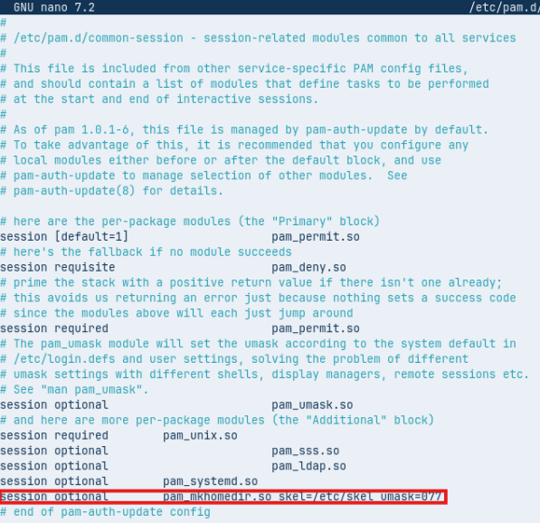

Després entrarem en aquest altre fitxer i afegim la línea marcada.

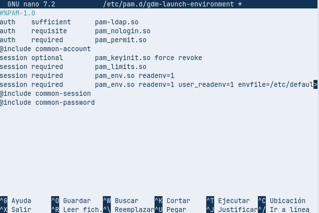

Ara reiniciarem la màquina per iniciar sessió per on diu ¿No está en la lista?.

Aqui posem de nom d’usuari manager01 i posem la contrasenya del LAM.

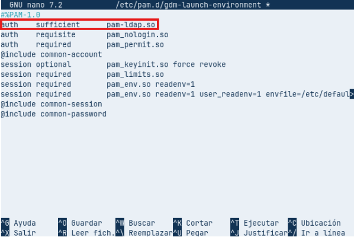

Si hem pogut iniciar sessió, tornem a entrar a la terminal i comprovem que l’usuari estigu bé.

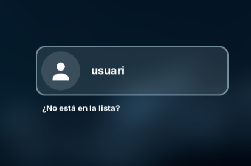
