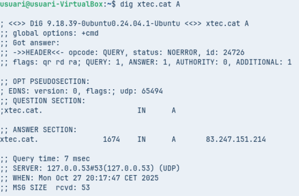
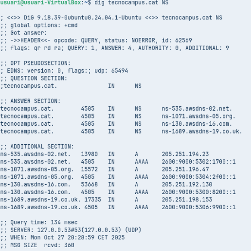
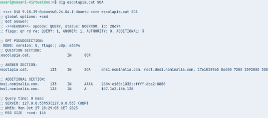
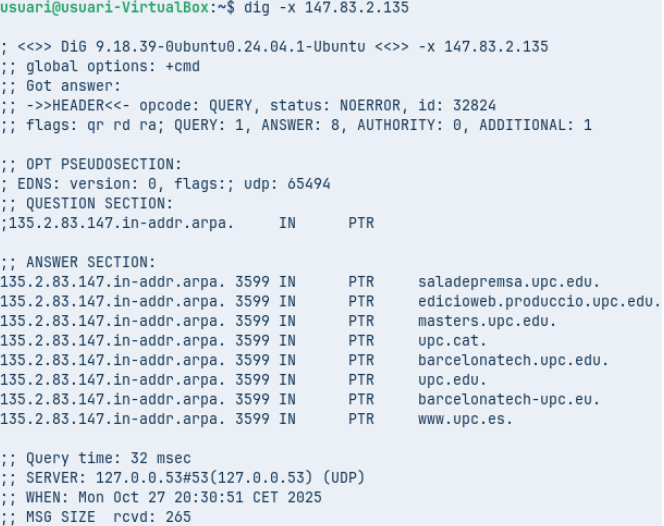
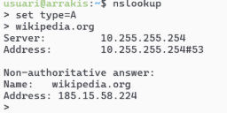
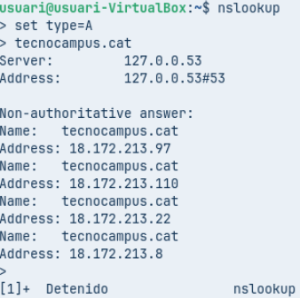
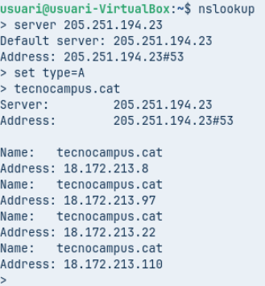

## T06: Fonaments del servei DNS

A. Diagnosi Avançada amb dig (Linux / macOS)
Comanda 1: Consulta Bàsica de Registre A
- Executa dig xtec.cat A

- Anàlisi: Identifica la IP de resposta, el valor TTL i el servidor que ha respost a la consulta.
La ip de resposta és la 83.247.151.214, El valor TTL és 2217 i el servidor que a respost a la consulta és SERVER: 127.0.0.53#53(127.0.0.53) (UDP).

Comanda 2: Consulta de Servidors de Noms (NS)
- Executa dig tecnocampus.cat NS

- Anàlisi: Quins són els servidors de noms autoritatius per a aquest domini?
Els servidors de noms autoritatius per a el domini son els que surten en la secció que diu ANSWER SECTION, es a dir:
- tecnocampus.cat. 4505 IN NS ns-535.awsdns-02.net. 
- tecnocampus.cat. 4505 IN NS ns-1071.awsdns-05.org. 
- tecnocampus.cat. 4505 IN NS ns-130.awsdns-16.com. 
- tecnocampus.cat. 4505 IN NS ns-1689.awsdns-19.co.uk.

Comanda 3: Consulta Detallada SOA
- Executa dig escolapia.cat SOA

- Anàlisi: Quina és la informació del correu de l'administrador i el número de sèrie del domini?
La informació del correu de l’administrador és root@dns1.nominalia.com i el número de serie del domini és 1761028945.

Comanda 4: Consulta resolució inversa
- Executa comanda dig -x 147.83.2.135

- Anàlisi: Quina informació sobre els registres s’obté?
La informació que s'obté són les ip que s’associen amb noms de dominis que són els que estan a la part de ANSWER SECTION.

Comprovació de Resolució amb nslookup (Multiplataforma)
L’eina nslookup es troba a pràcticament a qualsevol sistema operatiu. Es pot usar de forma similar a dig incloent l’argument o si s’executa nslookup sense arguments, entrar en el mode interactiu, us apareix un prompt (>).
Serà aquest mode el que explorareu . 

El mode és força senzill, bàsicament hi ha tres comandes a usar:
set type= per indicar el tipus de consulta: A, AAA, MX, NS, SOA, TXT o ALL.
server IP on IP és la IP del servidor de noms al que es vol fer la consulta, també es pot indicar el nom del servidor enlloc de la IP, per exemple, server a9-66.akam.net.
exit que serveix per sortir de la comanda.
Comanda 1: Consulta Bàsica no Autoritativa
- Seleccionar type=A i com a domini de consulta tecnocampus.cat

- Anàlisi: Per què indica que la resposta és no autoritativa?
Perquè el servidor que he buscat no te la informació original del domini sinó que ha agafat la resposta d’un altre servidor i l’ha guardat el caché.

Comanda 2: Consultes autoritatives
- Escriure server IP i escriure la IP del primer servidor de noms del domini tecnocampus.cat que s’ha obtingut d’una consulta anterior. A continuació, indiqueu que voleu consultar registres de tipus A i del domini
tecnocampus.cat

- Anàlisi: Quines diferències s’observen a la resposta obtinguda amb la comanda 1?
La principal diferencia és que al posar la informació original del domini, a buscat informació que si existeix i dona autoritatiu.

Resolucions locals
Finalment es vol comprovar el funcionament de la resolució local, útil per entorns de xarxa local on no es disposa de servidor de noms propi i que evita haver d’accedir a equips o recursos per la seva IP.
Activitat de la Fase Pràctica: Crear un document guia.md del resultats i anàlisi que inclogui les captures de les 5 comandes anteriors i les explicacions relacionades.

